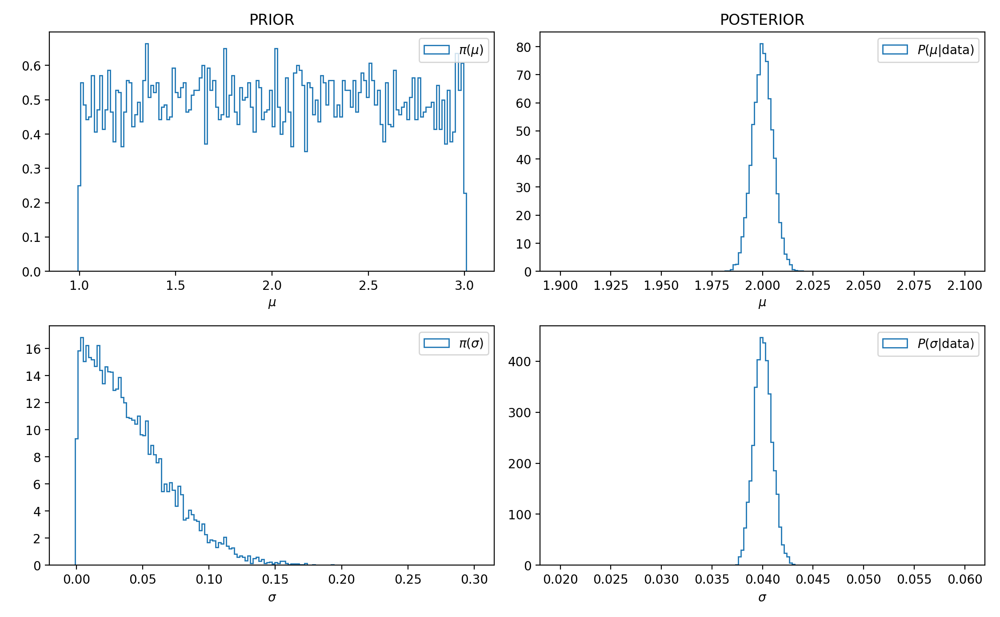

# KissABC

[](https://github.com/francescoalemanno/KissABC.jl/actions)
[](https://codecov.io/gh/francescoalemanno/KissABC.jl)
[](https://francescoalemanno.github.io/KissABC.jl/dev)

Table of Contents
=================

  * [Beginners Usage Guide](#usage-guide)
  * [Details](#details)

## Usage guide

The ingredients you need to use Approximate Bayesian Computation:

1. A simulation which depends on some parameters, able to generate datasets similar to your target dataset if parameters are tuned
1. A prior distribution over such parameters
1. A distance function to compare generated dataset to the true dataset

We will start with a simple example, we have a dataset generated according to an Normal distribution whose parameters are unknown
```julia
tdata=randn(1000).*0.04.+2
```
we are ofcourse able to simulate normal random numbers, so this constitutes our simulation
```julia
sim((μ,σ), param) = randn(100) .* σ .+ μ
```
The second ingredient is a prior over the parameters μ and σ
```julia
using Distributions
using KissABC
prior=Factored(Uniform(1,3), Truncated(Normal(0,0.1), 0, 100))
```
we have chosen a uniform distribution over the interval [1,3] for μ and a normal distribution truncated over ℝ⁺ for σ.

Now all that we need is a distance function to compare the true dataset to the simulated dataset, for this purpose a Kolmogorov-Smirnoff distance is good
```julia
using StatsBase
function ksdist(x,y)
    p1=ecdf(x)
    p2=ecdf(y)
    r=[x;y]
    maximum(abs.(p1.(r)-p2.(r)))
end
```
Now we are all set, first we define an `ABCplan` via

```julia
plan=ABCplan(prior, sim, tdata, ksdist)
```
where ofcourse the four parameters are the ingredients we defined earlier in the previous steps, and then
we can use `ABCSMCPR` which is sequential Monte Carlo algorithm to simulate the posterior distribution for this model
```julia
res,Δ = ABCSMCPR(plan, 0.1, nparticles=200,parallel=true)
```
Or, we can use `ABCDE` which is still an SMC algorithm, but with an adaptive proposal, which is much more efficient
```julia
res,Δ = ABCDE(plan, 0.1, nparticles=200,parallel=true)
```
In any case we chose a tolerance on distances equal to `0.1`, a number of simulated particles equal to `200`, we enabled Threaded parallelism, and the simulated posterior results are in `res`, while in `Δ` we can find the distances calculated for each sample.
We can now extract the results:
```julia
prsample=[rand(prior) for i in 1:5000] #some samples from the prior for comparison
μ_pr=getindex.(prsample,1) # μ samples from the prior
σ_pr=getindex.(prsample,2) # σ samples from the prior
μ_p=getindex.(res,1) # μ samples from the posterior
σ_p=getindex.(res,2) # σ samples from the posterior
```
and plotting prior and posterior side by side we get:


we can see that the algorithm has correctly inferred both parameters, this exact recipe will work for much more complicated models and simulations, with some tuning.

## Details
This package currently implements 3 algorithms whose details can be found in Docs

1. `ABC` this is a standard rejection algorithm, you can find examples in `test/runtests.jl`
1. `ABCSMCPR` this is the sequential monte carlo algorithm by Drovandi et al. 2011, you can find an examples in `test/runtests.jl`
1. `ABCDE` this is the sequential monte carlo algorithm based on differential evolution by B.M. Turner 2012, you can find an examples in `test/runtests.jl` (this algorithm tends to be the most efficient)
